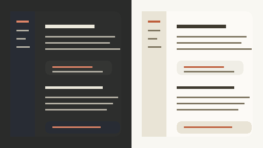

# Claude Warm

<p align="center">
  
</p>

<p align="center">
  <a href="https://community.obsidian.md/themes/claude-warm"></a>
  <a href="https://github.com/amm10090/claude-warm-obsidian-theme/releases/latest"></a>
  <a href="LICENSE"></a>
</p>

<p align="center">
  
  
  
</p>

A warm, quiet theme for Obsidian with soft ivory surfaces, charcoal depth, and a restrained Claude-clay accent system.

Claude Warm is inspired by Claude's calm, low-contrast interface: comfortable enough for long writing sessions, structured enough for dense vaults, and polished enough for a professional workspace.

## Design language

| Surface | Direction |
| --- | --- |
| Backgrounds | Soft ivory in light mode, layered charcoal in dark mode |
| Text | Warm ink and soft cream for comfortable reading contrast |
| Accents | Warm clay for links, tags, selections, and focused controls |
| Shapes | Rounded panes, gentle borders, and quiet shadows |

## Features

- Light and dark color schemes tuned as a matched pair
- Warm backgrounds with restrained contrast for long-form reading and editing
- Warm-clay accents for links, tags, selections, and focused controls
- Softer sidebars, tabs, menus, modals, tables, callouts, and code blocks
- No remote fonts or external assets in the theme CSS

## Install

### From Obsidian

Claude Warm is available in the Obsidian community theme directory:

<p>
  <a href="https://community.obsidian.md/themes/claude-warm"></a>
  <a href="obsidian://show-theme?name=Claude%20Warm"></a>
</p>

To install from Obsidian:

1. Open Obsidian Settings.
2. Go to `Appearance`.
3. Next to `Themes`, click `Manage`.
4. Search for `Claude Warm` and click `Use`.

### Manually

1. Create a folder named `Claude Warm` in your vault at `.obsidian/themes/`.
2. Copy `manifest.json` and `theme.css` into that folder.
3. Restart Obsidian.
4. Go to `Settings -> Appearance -> Themes` and choose `Claude Warm`.

## Palette

| Role | Light | Dark |
| --- | --- | --- |
| Background | `#F8F7F2`, `hsl(51, 28%, 95%)` | `#2A2B2A`, `#2D2E2D` |
| Text | `hsl(47, 15%, 25%)` | `hsl(50, 14%, 91%)` |
| Accent | `#BD5D3A` | `#DF8568` |
| Code accent | `#BD5D3A` | `#DF8568` |

## Development

Claude Warm keeps the source intentionally small. Most of the theme is built from Obsidian CSS variables, with a few light selectors for surfaces that need a softer shape.

Files worth knowing:

| File | Purpose |
| --- | --- |
| `theme.css` | Theme source |
| `manifest.json` | Obsidian theme manifest |
| `versions.json` | Theme version to minimum Obsidian version map |
| `screenshot.png` | Community theme preview image |

Run the local validator before release:

```bash
node scripts/validate-theme.mjs
```

Regenerate the 512 x 288 preview image:

```bash
node scripts/generate-screenshot.mjs
```

## Release

Releases are created by GitHub Actions when a version tag is pushed.

1. Update `manifest.json` and `versions.json` to the new version.
2. Commit the change.
3. Create and push a tag that exactly matches `manifest.json`, for example:

```bash
git tag 1.0.0
git push origin 1.0.0
```

4. GitHub Actions creates a draft release and uploads `manifest.json` and `theme.css`.
5. Review the generated release notes, then publish the draft.

## Feedback

Issues and pull requests are welcome. Screenshots are especially helpful for UI bugs, since many theme problems depend on plugins, panes, and operating system settings.

## License

MIT
